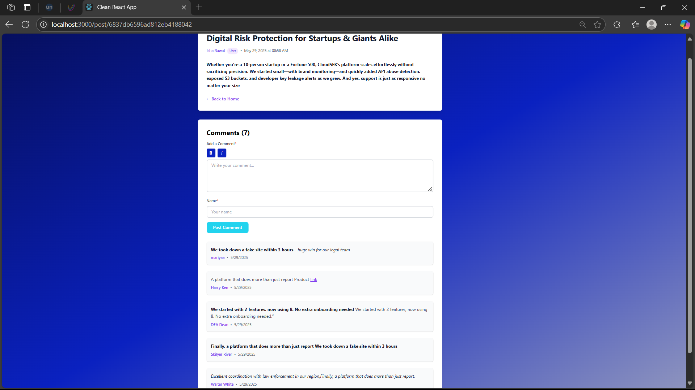

# Post & Comments Service

A modern, full-stack application for creating and managing posts with real-time comments. Built with the MERN stack (MongoDB, Express.js, React, Node.js) and featuring a beautiful, responsive UI with markdown support.

## Screenshots

### Main Features Preview





## Features

### Core Functionality
- **Post Management**
  - Create, read, update, and delete posts
  - Rich text formatting with markdown support
  - Real-time preview while writing
  - Post categorization with author roles (User, Admin, Moderator)

### Advanced Features
- **Text Formatting**
  - Bold text formatting (**text**)
  - Italic text formatting (*text*)
  - Hyperlink support ([text](url))
  - Live preview of formatted text
  - User-friendly formatting buttons (B/I)

- **Comments System**
  - Real-time comment updates
  - Markdown support in comments
  - Nested comment threading
  - Author attribution
  - Timestamp tracking

- **UI/UX Features**
  - Responsive design for all devices
  - Modern metallic theme with custom colors:
    - Dark navy (#050A44)
    - Royal blue (#0A21C0)
    - Light metallic gray (#B3B4BD)
  - Smooth transitions and hover effects
  - Loading states and error handling
  - Form validation

## Technical Implementation

### Frontend (React)
- Modern React with Hooks and Context API
- Tailwind CSS for styling
- Component-based architecture
- Real-time markdown parsing
- Form validation and error handling
- Responsive design principles

### Backend (Node.js/Express)
- RESTful API architecture
- MongoDB with Mongoose ODM
- Input validation and sanitization
- Error handling middleware
- CORS and security headers
- Environment-based configuration

### Database (MongoDB)
- Document-based data model
- Efficient indexing
- Data validation schemas
- Relationship handling between posts and comments

## Getting Started

### Prerequisites
- Docker Desktop
- Docker Compose

### Quick Start with Docker

1. Download the application:
```bash
curl -L https://github.com/Dabhadevivek/post-comments-service/archive/main.zip -o post-comments.zip
unzip post-comments.zip
cd post-comments-service
```

2. Start the application using Docker Compose:
```bash
docker-compose up --build
```

This will:
- Build and start the React frontend (accessible at http://localhost:3000)
- Start the Node.js backend server (accessible at http://localhost:5000)
- Initialize MongoDB database
- Set up all necessary networking and volumes

### Accessing the Application

- Frontend Application: http://localhost:3000
- Backend API: http://localhost:5000
- MongoDB: mongodb://localhost:27017

### Docker Container Management

View running containers:
```bash
docker-compose ps
```

View container logs:
```bash
# All containers
docker-compose logs

# Specific container
docker-compose logs client    # Frontend logs
docker-compose logs server    # Backend logs
docker-compose logs mongodb  # Database logs
```

Stop the application:
```bash
docker-compose down
```

Remove all containers and volumes:
```bash
docker-compose down -v
```

### Development with Docker

For development with hot-reload:
```bash
# Start in development mode
docker-compose -f docker-compose.yml -f docker-compose.dev.yml up
```

### Troubleshooting

1. If the client can't connect to the server:
   - Check if all containers are running: `docker-compose ps`
   - Verify the REACT_APP_API_URL in docker-compose.yml

2. If MongoDB connection fails:
   - Ensure MongoDB container is running: `docker-compose logs mongodb`
   - Check the MONGODB_URI in server environment variables

3. For permission issues:
   - Run `docker-compose down -v`
   - Delete the node_modules folders
   - Rebuild with `docker-compose up --build`

## API Documentation

### Posts
- `GET /api/posts` - Get all posts
- `GET /api/posts/:id` - Get single post
- `POST /api/posts` - Create new post
- `PUT /api/posts/:id` - Update post
- `DELETE /api/posts/:id` - Delete post

### Comments
- `GET /api/posts/:postId/comments` - Get comments for a post
- `POST /api/posts/:postId/comments` - Add comment to post
- `PUT /api/comments/:id` - Update comment
- `DELETE /api/comments/:id` - Delete comment

## Code Quality

- Well-structured component hierarchy
- Consistent code formatting with ESLint/Prettier
- Comprehensive error handling
- Type checking with PropTypes
- Modular and reusable components
- Clean and maintainable code architecture

## Security Features

- Input sanitization
- XSS protection
- CORS configuration
- Rate limiting
- Environment variable protection
- Secure password hashing (for future auth implementation)

